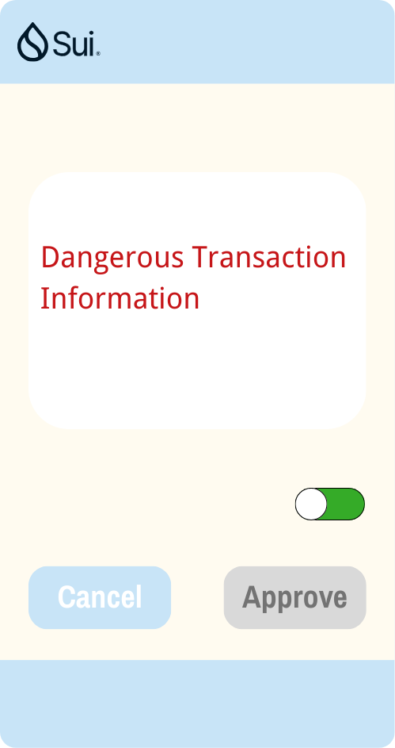

# UX Pattern

This section introduces common design patterns for integrating dryRunPlus into wallet applications.

Return Data Structure

```TypeScript
export interface Response {
  dryRun: DryRunTransactionBlockResponse;
  pass: boolean;
  msg: String | undefined;
}
```

## Normal Transaction

When no transaction risks are identified, the `pass` value is `true`, and the wallet displays the `DryRunTransactionBlockResponse` information normally.

<figure><figcaption><p>Normal Transaction</p></figcaption></figure>


## Risky Transaction

When transaction risks are identified, the `pass` value is `false`, and there are two patterns for intercepting user transaction signatures.

### Risk Pattern A

<figure><figcaption><p>Pattern 1</p></figcaption></figure>

Display the risk information in the transaction, that is, `Response.msg`. Change the transaction signature button to a warning color, such as red.

### Risk Pattern B

<figure><figcaption><p>Pattern 2</p></figcaption></figure>

Display the risk information in the transaction, that is, `Response.msg`. Change the transaction signature button to gray and make it unusable. If the user insists on trusting the transaction, they can first disable `dryRunPlus` by using the switch button.